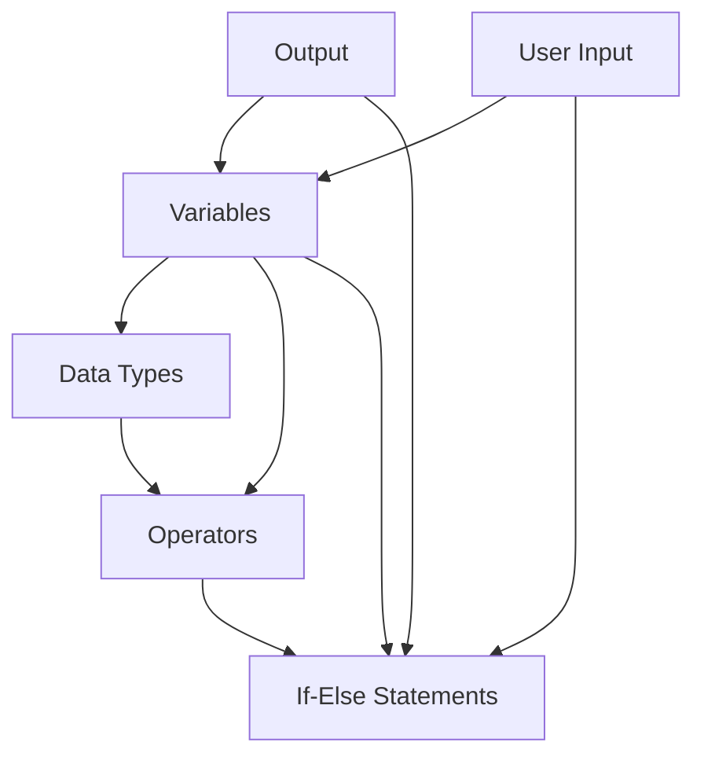

# C-practice

## C++ Learning Progress

Below is a diagram showing how the topics I've learned in C++ are connected:

**Legend:**
- **Output**: Printing information to the user (e.g., `cout`)
- **Variables**: Storing data
- **User Input**: Getting data from the user (e.g., `cin`)
- **Data Types**: Types of data (int, float, char, etc.)
- **Operators**: Arithmetic, comparison, logical, etc.
- **If-Else Statements**: Making decisions in code

---